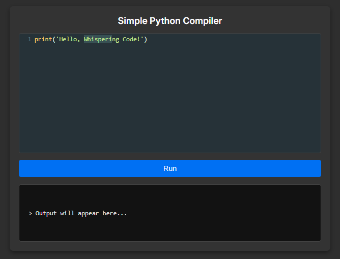

# Simple Python Compiler

Este é um compilador simples feito em Python, com foco educacional. Ele simula as etapas básicas de compilação de código — como análise léxica, parsing e execução — permitindo entender como funciona, por dentro, a interpretação de linguagens de programação. É uma ferramenta útil para estudo de compiladores, construção de interpretadores e experimentação com estruturas de linguagem.

# Screenshot
Aqui temos a captura de tela do projeto:

